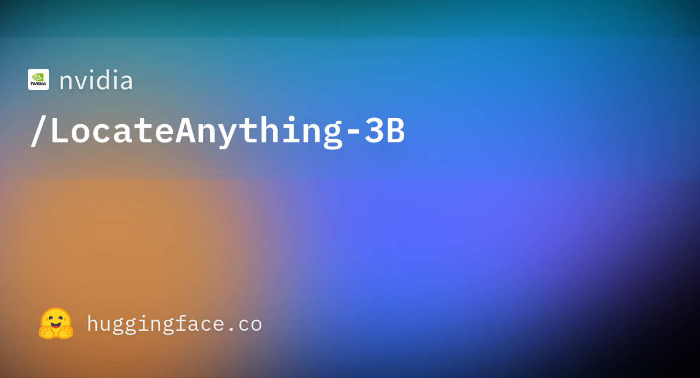

<h1 align="left"><b>Hello, I'm Brieuc</b> </h1>

<em>Machine Learning / AI enthusiast, studied at <a href="https://www.gatech.edu/" target="_blank">Georgia Tech</a> (MS Computer Science) and <a href="https://www.telecom-sudparis.eu/" target="_blank">Telecom SudParis</a> (diplôme d'ingénieur)</em>

> **How to reach me:** brieucpopper@gmail.com or via <a href="https://www.linkedin.com/in/brieucpopper/" target="_blank">LinkedIn</a>

---

<h3> Here are some personal and academic projects. Click on the images to learn more.</h3>

---

### [YO-YOLO — Your Own Detector from One Sentence](https://github.com/brieucpopper/yo-yolo)
*Sep 2026 — Personal project*

---

### [Multimodal RAG for Video Question Answering](https://github.com/brieucpopper/LLaVA_RAG/tree/master#readme)
*Oct 2024 — Georgia Tech, CS 8803 VLM*

---

### [Lung Segmentation with U-Net](https://github.com/brieucpopper/lungSegmentationUnet/tree/main#readme)
*Nov 2023 — Team project @ Telecom SudParis*

---

### [A 3D Tetris Game with Manual 2D Rendering](https://github.com/brieucpopper/3dtetris/tree/main#readme)
*Mar 2022 — Team project @ Telecom SudParis*

---

### [A 2v2 Drawing Competition Web Game](https://github.com/brieucpopper/drawhosted/tree/master/Projet%20Final)
*Apr 2022 — Web programming project @ Telecom SudParis*

---

### [A Custom 16-bit Computer Made from Logic Gates](https://github.com/brieucpopper/logismcomputer)
*Apr 2022 — Personal project (nand2tetris-inspired)*

---

### [Encoding Drawings with Fourier Coefficients](https://github.com/brieucpopper/TIPE-fourier-bezier/tree/main/projet%20Encodage%20fourier)
*Mar 2022 — TIPE, CPGE (prépa)*

---

### [Fine-tuning a Tiny LLM for Sentiment Analysis](https://github.com/jadenzwicker/DL-Final-Project/tree/main#readme)
*Sep 2024 — Georgia Tech, CS 7643 Deep Learning*

